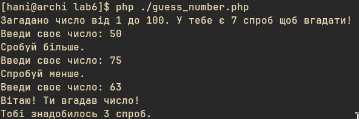
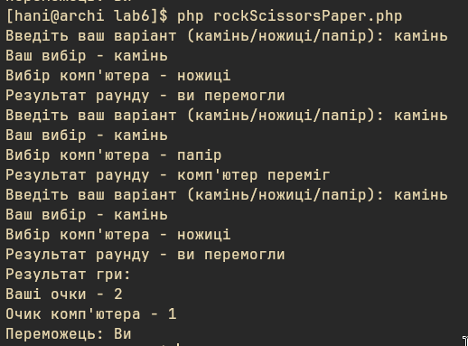
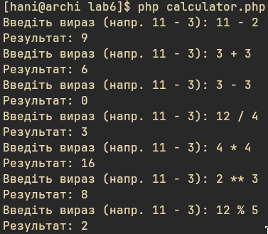
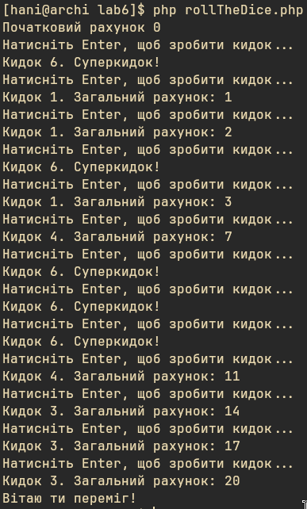

# PHP CLI Games

A collection of small interactive command-line games written in PHP.

## Games

### Guess the Number
Guess a random number between 1 and 100 in 7 attempts. After each guess you get a hint (higher/lower).

```bash
php guessNumber.php
```

### Rock Scissors Paper
Play 3 rounds of Rock, Scissors, Paper against the computer.

```bash
php rockScissorsPaper.php
```

### Calculator
Simple CLI calculator. Enter an expression like `11 - 3` and get the result.
Supported operators: `+`, `-`, `*`, `/`, `**`, `%`

```bash
php calculator.php
```

### Roll the Dice
Roll a six-sided die and accumulate points. Reach exactly 20 to win — go over and you lose. Rolling 6 is a super roll that doesn't add points.

```bash
php rollTheDice.php
```

## Screenshots

| Guess the Number | Rock Scissors Paper |
|---|---|
|  |  |

| Calculator | Roll the Dice |
|---|---|
|  |  |

## Requirements

- PHP 7.4+
